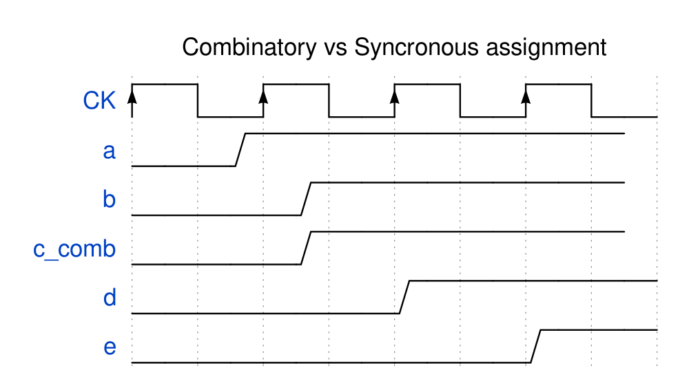
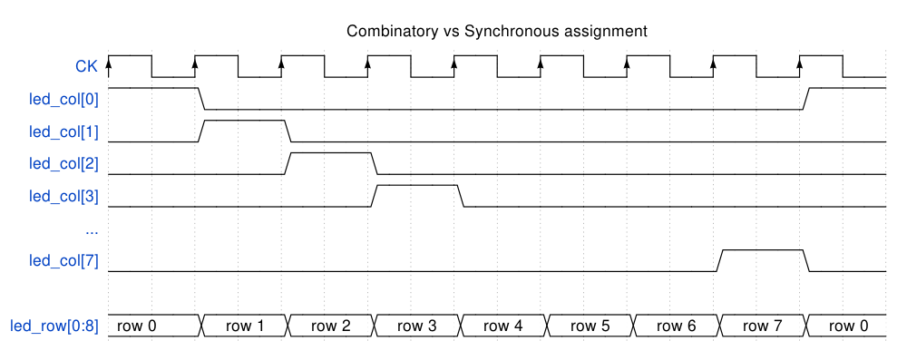
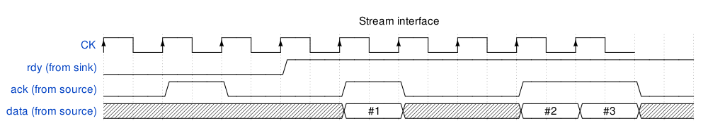

# FPGA Pong!

## Workshop overview

[Field Programmable Gate Arrays](https://en.wikipedia.org/wiki/Field-programmable_gate_array) differ a lot from better-known CPUs. Instead of a defined set of instructions executed in a sequence, a FPGA allow the use to define logic, at the bit level, running entirely in parallel.
If it's possible to implement (simple) CPUs inside an FPGA, the parallel nature of an FPGA allow to address problems typically difficult (or impossible) to solve using a CPU, such as precise timings or massively parallel calculation.

In this workshop we'll scratch the surface of FPGA possibilities with the implementation of a Pong game on the Lattice Icestick Evaluation Board, and a specially designed LED and button board.


## Toolchain installation

You will need a recent Python 3 installation (>=3.7) and `pip` to install the FPGA toolchain (yosys + nextprn) and amaranth (formerly known as nmigen) Hardware Description Language and builder.

```bash
python -m venv env
source env/bin/activate

pip install --upgrade git+https://github.com/amaranth-lang/amaranth.git
pip install --upgrade git+https://github.com/amaranth-lang/amaranth-boards.git
pip install --upgrade git+https://github.com/amaranth-lang/amaranth-soc.git
pip install --upgrade git+https://github.com/amaranth-community-unofficial/amlib.git
pip install --upgrade yowasp-yosys
pip install --upgrade yowasp-nextpnr-ice40
```

You will also need `iceprog` to load the FPGA "bitstream" (configuration file). Chances are, you won't find it in your favourite's distribution so you either have to use [pre-comppiled binaries](https://github.com/FPGAwars/toolchain-icestorm/wiki) or build it from sources.
```bash
git clone https://github.com/YosysHQ/icestorm.git
cd icestorm/iceprog
make
sudo make install
```

You will also probably need an udev rule so the FTDI chip onto the Icestick can be accessed:
```bash
$ cat /etc/udev/rules.d/11-ftdi.rules
SUBSYSTEMS=="usb", ENV{.LOCAL_ifNum}="$attr{bInterfaceNumber}"
SUBSYSTEM=="tty", ATTRS{idVendor}=="0403", ATTRS{idProduct}=="6010", MODE="0666"
```

The installation can be verified by building and loading a simple LED blinker:
```bash
$ python -m amaranth_boards.icestick
init..
cdone: high
reset..
cdone: low
flash ID: 0x20 0xBA 0x16 0x10 0x00 0x00 0x23 0x71 0x85 0x32 0x12 0x00 0x33 0x00 0x41 0x11 0x06 0x17 0xAA 0xF2
file size: 32220
erase 64kB sector at 0x000000..
programming..
done.                 
reading..
VERIFY OK             
cdone: high
Bye.
```
You should see all 5 LEDs of the icestick blink at 1Hz frequency.


## Building Blocks

### Module()

An amaranth design is a Module() instances tree.
A simple design might look like this:
```
top_module
  - submodule 1
    - submodule 1.1
      - submodule 1.1.1
    - submodule 1.2
  - submodule 2
```

Submodules are added to the `submodules` member:
```python
m = Module()
m.submodules.submodule_1 = Module()
```

### Signal()

a Signal() instance either represents a wire (directly connects logic or pins), or a DFF (a D Flip Flop is a type of latch).
A DFF has a data input, a data output, and a clock input. On a clock edge, the data output takes the value of the input and keeps it until next clock cycle.
It can be used as a memory bit or as a mean to delay a Signal() by one clock cycle.

Signal() can also be a vector which can represent integer values
```python
bit = Signal()
word = Signal(16)
lsb = word[0:8]
msb = word[8:16]
```

### Statements

Statements are logic expressions which can either be combinatorial or synchronous.
Synchronous statements are equivalent to combinatoral statements followed by a DFF.


```
m = Module()

a = Signal()
b = Signal()
c = Signal()
d = Signal()

m.comb += c.eq(a & b)  # "c = a & b" must use `.eq()` !

# these two assignments are equivalent
m.sync += d.eq(a & b)
m.sync += d.eq(c_comb)

# `e` is delayed from `d` by 1 clock cycle
m.sync += e.eq(d)
```
Which would result in the following timing diagram:



If() and Else() statements can also be used:
```python
# we can write `m.comb += c.eq(a & b)` this way:
with m.If(a & b):
    m.comb += c.eq(1)
else:
    m.comb += c.eq(0)
```


## Build system

Amaranth can take care of ressources (like IO/pin assignment) and call the correct FPGA toolchain.
Instanciate a platform and call the builder:
```
platform = ICEStickPlatform()
platform.build(MyFabulousDesign(), do_program=True)
```

## Step 1 - basic logic and assignations

Modify the source to count the number of presses on the Player 1's buttons, and display it on the first LED row.
The 'left' button decrements the counter, while the 'right' button increments it.


### Button debouncing
Mechanical switches have a 'bounce' effect when they are pressed, which can lead to multiple flanks being generated (and counted) when pressing the button only once.
Usually, the 'debounce' method consists of ignoring edges for a short (10s of ms range) period of time after the first edge has been counted.


## Step 2 - adding rackets

### LED multiplexing
The LEDs are multiplexed to reduce the amount of IOs required to drive them. A single bit is set on `led_row` at a time, which enables the selected line. The value of each LED of this line is then controlled by `led_col`



The scanning logic has been implemented in `LEDMatrix` class, which provides a simple `Array()` to interface with the LEDs.

### Racket implementation

A racket is two LEDs lit up. It must be controllable via the pushbuttons.
Parts of the implementation has already been done in the `Racket` class, you now have to finish it.

## Step 3 - Score counting
We have created a class `Ball` which implements the movement of the ball.
The ball rebounds on all sides of the play area, but we don't detect scores yet.

Implement the logic to detect scores. When a score is detected, increment the opposing player's score, and reset the ball position.
When the 'reset' button is pressed, reset both scores.


## Step 4 - Score display
We will now use a small Amaranth library which provides a UART interface. This UART interface will be connected to the FTDI chip on the Icestick board, and will transmit the scores each time they change.
Using a serial terminal emulator (such as picocom, microcom, minicom, [putty](https://www.putty.org/), screen (including on macOS)).

### Serial terminal emulator
If you wish to validate that your serial terminal works as intended, you can run `uart_demo.py` program. It'll display the 'A' character in a loop.
On Linux, this command will typically work:
```bash
$ picocom /dev/ttyUSB1 -b 115200
picocom v3.1

port is        : /dev/ttyUSB1
flowcontrol    : none
baudrate is    : 115200
[...]
Type [C-a] [C-h] to see available commands
Terminal ready

AAAAAAAAAAAAAAAAAAAAAAAAAAAAAAAAAAAAAAAAAAAAAAAAA[...]
```

### Stream interface
Stream interface allow to transfer data from a *source* to a *sink*, using only two control signals:
* `ack`: generated by the *source* when the data is ready (valid)
* `rdy`: must be generated by the *sink*

A data is considered transferred when both `ack` and `rdy` are 1 (at the same time).



### UART
The `AsyncSerialTX` *Elaboratable* class provides the UART transmitter. It's instanciated with a divisor (which sets the baudrate) and pins (only the 'tx' pin will be used).
The stream interface (the UART acts as a sink) comprises of these member signals:
* `AsyncSerialTX().data`: data byte to be transmitted, must be driven externally
* `AsyncSerialTX().rdy`: UART is ready to transmit, driven by the UART
* `AsyncSerialTX().ack`: data is valid, must be driven externally

```python
from amlib.io.serial import AsyncSerialTX
uart_pins = platform.request("uart")
uart = m.submodules.uart = AsyncSerialTX(divisor=int(platform.default_clk_frequency // 115200),
                                         pins=uart_pins)
# Send the 'A' character in loop
m.d.comb += [
    uart.data.eq(int(ord('A'))),
    uart.ack.eq(1),
    # a byte will be sent by the UART when uart.rdy == 1
]
```

### Finite State Machine
FSM are useful for anything requiring to follow a certain sequencing. Amaranth can easily create FSM:

```python
m.d.comb += uart.ack.eq(0)  # this assignment is redundant since Signals() typically default to 0
with m.FSM(name="visualize_uart"):
    with m.State("IDLE"):
        m.d.comb += uart.ack.eq(1)
        with m.If(uart.rdy):  # uart.data has been transferred
            m.next = "TX"
            m.d.sync += uart.data.eq(uart.data + 1)  # increment the next value to transfer
    with m.State("TX"):
        # in this state uart.ack = 0
        with m.If(uart.rdy):
            m.next = "IDLE"
```
In each state we can add assignments, which are valid only when the state is currently active.
To change the state at the next clock cycle, the `m.next` must be assigned the name of the next State.

### Implementation
When a score is changed, send the following string on the UART stream interface: `"{Player 1 score} - {Player 2 score}\n"`

A FSM (Finite State machine) can be useful to handle the sequential transmission of the score.
